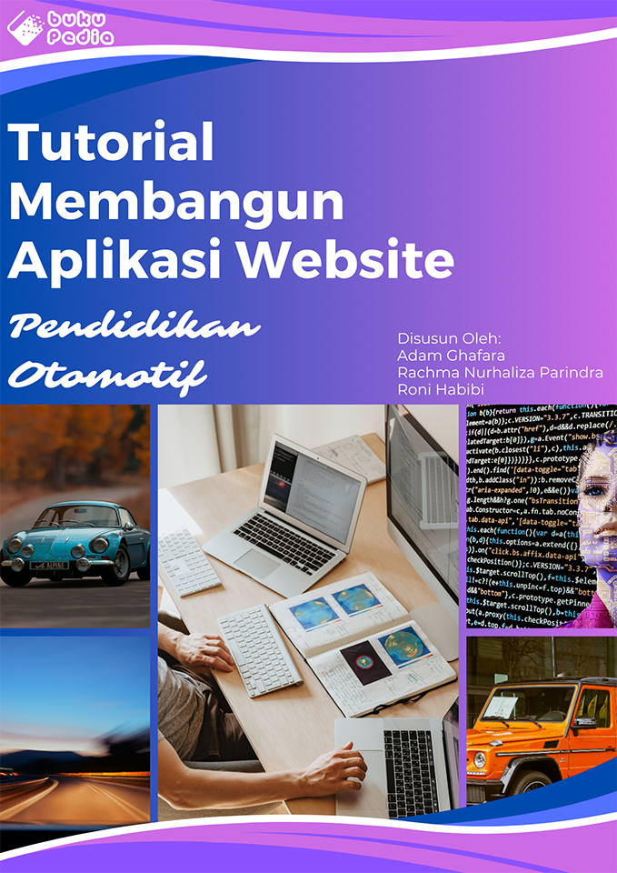

# Tutorial Membuat Aplikasi Website Pendidikan Otomotif

Penulis : 

Adam Ghafara
\
Rachma Nurhaliza Parindra
\
Roni Habibi

## PRAKARTA

Otomotif merupakan salah satu topik menarik bagi para pecinta mobil, motor, dan kendaraan bermesin lainnya. Selain itu, Otomotif menjadi bahan topik bagi mereka yang ingin mengenal lebih tentangnya, baik dalam perawatan kendaraan, tips dan trik, dan juga informasi terkini. Namun, informasi pada media internet yang membahas tentang otomotif terbilang sedikit dan sangat terbatas. Hal ini membuat beberapa dari mereka kesulitan mencari informasi tepat dan ter aktual dalam otomotif.

Buku ini bertujuan untuk memberikan pemahaman tentang pembuatan website berteknologi Golang dan JavaScript untuk mendukung pemahaman yang lebih mendalam tentang teknologi tersebut. Dengan menggunakan Golang sebagai bahasa pemrograman backend, kalian dapat menciptakan aplikasi dasar dengan kinerja yang tinggi, kehandalan, dan kemampuan untuk mengelola beban kerja dengan efisien. Meskipun demikian, penggunaan JavaScript pada sisi frontend memungkinkan pembuatan antarmuka pengguna yang dinamis dan interaktif. Kombinasi kedua teknologi ini menjadi landasan untuk membangun pengalaman belajar yang kuat, yang menggabungkan komponen fungsionalitas backend yang canggih dengan responsivitas antarmuka pengguna yang menarik.

Oleh karena itu, Tutorial ini bertujuan untuk memberikan wawasan mendalam tentang pembuatan website dengan mengambil tema Otomotif sebagai bahan tutorial nya. Selain itu, Tutorial ini juga bertujuan untuk mendorong inovasi dalam penggunaan teknologi dalam pendidikan.

Buku ini juga memiliki source code sebagai bahan ajar yang dapat kalian akses menggunakan link github berikut:
https://github.com/berkatauto

## Daftar Isi

### [PRAKATA](#prakarta)
### [BAB I - Pendahuluan](./chapter/BAB%201%20-%20Pendahuluan/README.md)
#### [A. Pengenalan Aplikasi](./chapter/BAB%201%20-%20Pendahuluan/A.%20Pengenalan%20Aplikasi/README.MD)
#### [B. Tujuan dan Fungsi Tutorial](./chapter/BAB%201%20-%20Pendahuluan/B.%20Tujuan%20dan%20Fungsi%20Tutorial/README.md)
#### [C. Manfaat Tutorial](./chapter/BAB%201%20-%20Pendahuluan/C.%20Manfaat%20Tutorial/README.md)
### [BAB II - Pengenalan Otomotif](#bab-ii---pengenalan-otomotif)
#### [A. Konsep Dasar Otomotif](./chapter/BAB%202%20-%20Pengenalan%20Otomotif/A.%20Konsep%20Dasar%20Otomotif/README.MD)
#### [B. Perkembangan Otomotif Saat Ini](./chapter/BAB%202%20-%20Pengenalan%20Otomotif/B.%20Perkembangan%20Otomotif%20Saat%20Ini/README.MD)
#### [C. Keunggulan Dari Website Pendidikan Otomotif](./chapter/BAB%202%20-%20Pengenalan%20Otomotif/C.%20Keunggulan%20Dari%20Website%20Pendidikan%20Otomotif/README.MD)
### [BAB III - Dasar Pemrograman](./chapter/babiv.md)
#### [Bahasa Pemrograman](./chapter/BAB%203%20-%20Dasar%20Pemrograman/README.MD)
##### [a. HTML](./chapter/BAB%203%20-%20Dasar%20Pemrograman/A.%20Bahasa%20Pemrograman/a.%20HTML/README.MD)
##### [a. CSS](./chapter/BAB%203%20-%20Dasar%20Pemrograman/A.%20Bahasa%20Pemrograman/b.%20CSS/README.MD)
##### [a. Javascript](./chapter/BAB%203%20-%20Dasar%20Pemrograman/A.%20Bahasa%20Pemrograman/c.%20Javascript/README.MD)
##### [a. Golang (Go)](./chapter/BAB%203%20-%20Dasar%20Pemrograman/A.%20Bahasa%20Pemrograman/d.%20Golang%20(Go)/README.MD)
### [BAB V - Pembuatan Aplikasi Website](./chapter/babv.md)
