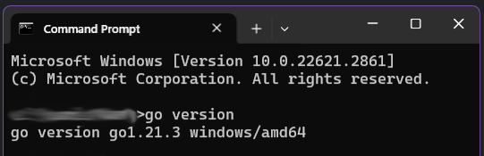

# d. Golang
Golang sebagai Bahasa pemrograman utama yang akan kita gunakan sebagai backend pada aplikasi ini. Untuk penginstalan aplikasi ini, silahkan masuk kedalam situs go.dev, kemudian pilih download untuk mengunduh aplikasi golang.

.png)

Pada tampilan berikut, silahkan pilih instalasi untuk windows, yang kemudian akan langsung di download oleh browser. Jika sudah, silahkan jalankan aplikasi instalasi golang nya, dan ikuti tahap penginstalannya. Untuk penginstalanya, pastikan kalian menginstalnya pada satu directory saja dan tidak ditempatkan dalam Program Files.

Contoh :
```
"C:\Go"
```
Selanjutnya, kalian perlu menambah environment untuk Golang. Silahkan ikuti tahap berikut:
1.	Buka Search dan Cari “Edit the System Environment Variables”
2.	Lalu buka “Environment Variables…”

.png)

3.	Pada bagian “User variables for (namauser)”. Silahkan pilih “New…”.

.png)

4.	Akan muncul jendela baru untuk mengisi variables yang ingin dibuat. Isikan Nama variable dengan “GOPATH”, dan masukkan Value dengan directory.

.png)

5. Save dan Restart perangkatnya.

Untuk mengetes apakah Golang terinstal dengan tepat, kita dapat mengecek instalasinya menggunakan Command Prompt (cmd). Silahkan buka aplikasi Command Promt dengan menggunakan “Search” pada windows dan tulis “cmd”. Setelah aplikasi terbuka, silahkan masukkan command “go version” dan eksekusikan. Tampilan hasilnya kurang lebih terlihat seperti berikut:

